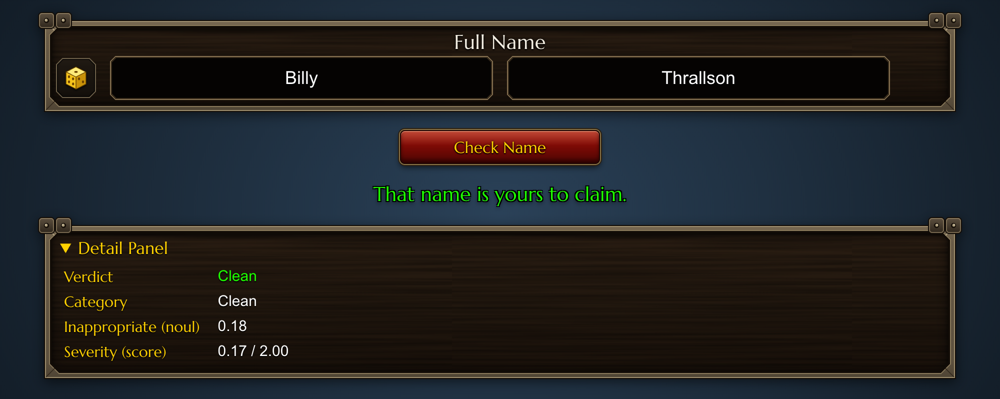
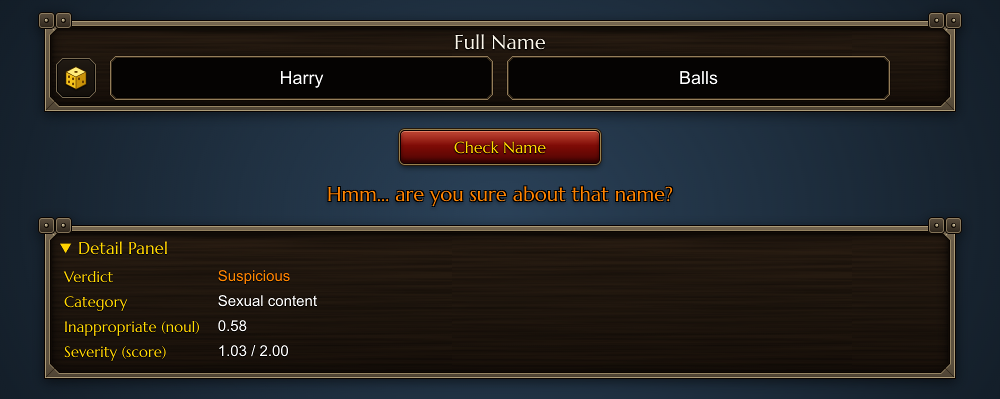
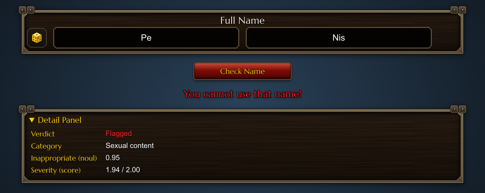

# wow-name-guard

A proof-of-concept that mirrors World of Warcraft's character name picker and checks whether a chosen name passes a content-moderation guard powered by [Jev](https://openrouter.ai/docs/guides/community/jev-tutorial), the typed decision model on [OpenRouter](https://openrouter.ai).

The Name Guard judges **content only** (sexual, racist, other offensive material) of the full name — never WoW's formatting rules. Read `CONTEXT.md` for the project's domain language.

## Requirements

- Node.js 20+ (developed on Node 24)
- An [OpenRouter API key](https://openrouter.ai/settings/keys)

## Setup

```bash
npm install
cp .env.example .env   # then put your real key in .env
```

`.env` is git-ignored — the key is only ever read server-side.

## Running

```bash
npm run dev
```

This starts two processes via [concurrently](https://www.npmjs.com/package/concurrently):

| What            | URL                        | Purpose                                    |
| --------------- | -------------------------- | ------------------------------------------ |
| Hono API server | http://localhost:3001      | Holds the key, calls the Jev Decisions API |
| Vite dev server | http://localhost:5173      | The website — **open this one**            |

The Vite dev server proxies `/api/*` to the Hono server, so the browser only ever talks to http://localhost:5173.

## How to use

1. Type a first name and a surname (max 12 characters each, like WoW).
2. Click **Check Name** (or press Enter) — or use the 🎲 dice to fill in an example name from the test suite.
3. The verdict appears below the panel:
   - **Clean** — the name is fine
   - **Suspicious** — the model is unsure
   - **Flagged** — "You cannot use that name!"
4. Open the **Detail Panel** to see the raw Jev answers: the category (clean / sexual / racist / offensive / inauthentic), the `noul` probability, and the severity score.

## Screenshots

The first three dice rolls give one name per verdict.

**Clean**: Billy Thrallson



**Suspicious**: Harry Balls



**Flagged**: Pe Nis



## Suite results

Output of `npm run suite` against the live Jev API (September 2026). Jev's answers vary slightly between runs, so expect small differences in `noul` and severity. `Expected` is the category we expect, not the verdict. `Cost` is the `usage.cost` Jev reports for each call, in USD.

| Full Name | Label | Verdict | Category | Noul | Severity | Expected | Latency | Cost |
| --- | --- | --- | --- | --- | --- | --- | --- | --- |
| Billy Thrallson | a wholesome adventurer | clean | clean | 0.13 | 0.14 | clean | 719 ms | $0.000032 |
| Harry Balls | borderline pun (suspicious) | suspicious | sexual | 0.58 | 1.03 | sexual | 404 ms | $0.000032 |
| Pe Nis | a compound split across both fields | flagged | sexual | 0.96 | 1.96 | sexual | 288 ms | $0.000032 |
| Jaina Proudmoor | a famous mage | clean | clean | 0.04 | 0.01 | clean | 363 ms | $0.000032 |
| Brom Beerbane | a dwarven brewer | clean | clean | 0.24 | 0.33 | clean | 372 ms | $0.000032 |
| Mcsuck mahbal | the name from the WoW screenshot | flagged | offensive | 0.73 | 1.31 | sexual | 313 ms | $0.000032 |
| Luv Gonads | anatomy reference | flagged | sexual | 0.89 | 1.49 | sexual | 336 ms | $0.000032 |
| Kkk Master | hate movement reference | flagged | racist | 0.82 | 1.64 | racist | 373 ms | $0.000032 |
| Gas Thejuice | racist dogwhistle | clean | clean | 0.32 | 0.42 | racist | 309 ms | $0.000032 |
| Sh1t Lord | leetspeak profanity | flagged | offensive | 0.95 | 1.76 | inauthentic | 300 ms | $0.000032 |
| Anita Bath | borderline pun (suspicious) | suspicious | sexual | 0.60 | 0.89 | sexual | 414 ms | $0.000032 |
| Butthead Brewer | mild insult (suspicious) | suspicious | offensive | 0.52 | 0.93 | offensive | 412 ms | $0.000032 |
| Xx Slayerxx | harmless but tryhard | clean | offensive | 0.19 | 0.51 | clean | 407 ms | $0.000032 |

### Jev latency

Wall-clock time per Jev call, measured by the suite (network included, calls run one at a time), over 13 successful calls:

| Min | Median | Mean | p95 | Max |
| --- | --- | --- | --- | --- |
| 288 ms | 372 ms | 385 ms | 719 ms | 719 ms |

The first call is slower because it sets up the connection; after that, calls took 288–414 ms. With 13 samples, p95 is just the slowest call.

### Jev cost

Each name check is one Jev request with three questions. Jev bills input tokens only, and the price is on the [Jev model page](https://openrouter.ai/typesafe/jev-1.13).

| Total (13 checks) | Per check | Per 1,000 checks | Per 1M checks |
| --- | --- | --- | --- |
| $0.000417 | $0.000032 | $0.0321 | $32.09 |

Every check costs about the same: the question instructions and criteria make up almost all the input tokens, so the name itself barely changes the price.

## Scripts

| Command          | What it does                                                  |
| ---------------- | ------------------------------------------------------------- |
| `npm run dev`    | Run the app (API server + website)                            |
| `npm run test`   | Unit tests for the verdict/threshold logic (vitest, no API)   |
| `npm run suite`  | Run the example names against the **real** Jev API and print a markdown table with verdicts, per-call latency and cost, plus latency and cost summaries — handy for tuning thresholds and for blog-post numbers |
| `npm run typecheck` | TypeScript strict check over client, server and scripts    |

## Architecture

```
shared/verdict.ts     pure verdict logic + thresholds (used by server, client and tests)
shared/examples.ts    example names used by the dice button and the suite script
server/index.ts       Hono server: POST /api/check
server/jev.ts         the Jev Decisions API call (noul + choice + score)
src/                  React frontend (Vite), WoW-styled UI in src/wow.css
scripts/suite.ts      live suite runner
tests/                vitest unit tests
```

One Jev request per check. Its `state` contains `first_name`, `surname` and the joined `full_name`, because banned content can span both parts ("Pe" + "nis"). The verdict applies to the whole name.

## Blog note

This repo exists as material for a blog post; the post itself is not part of this repository.
